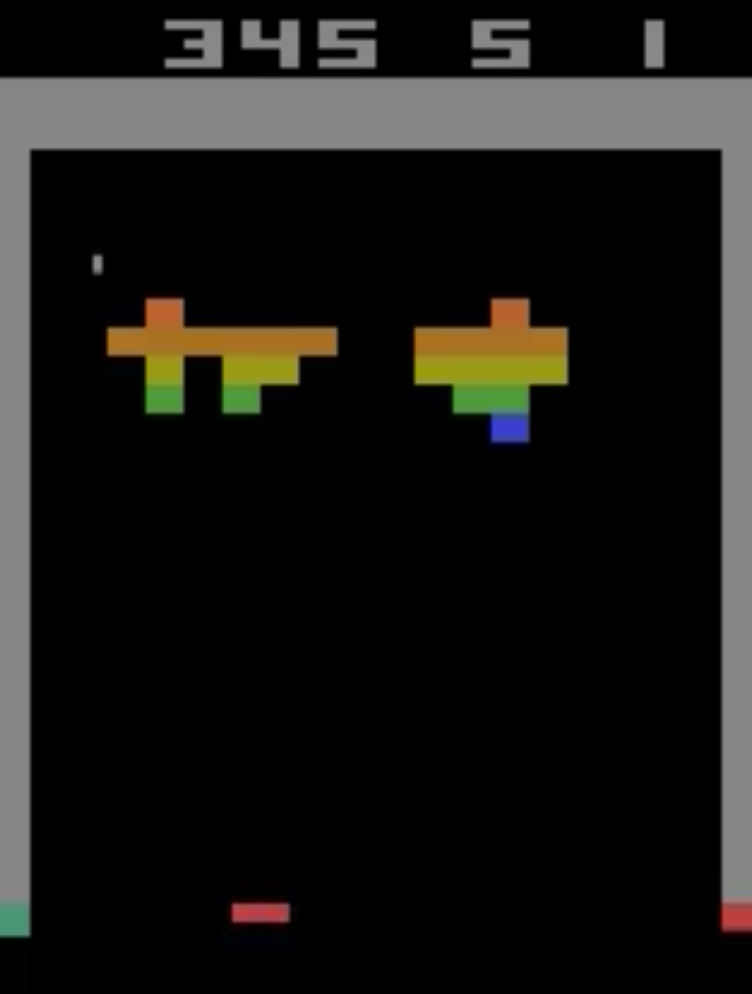
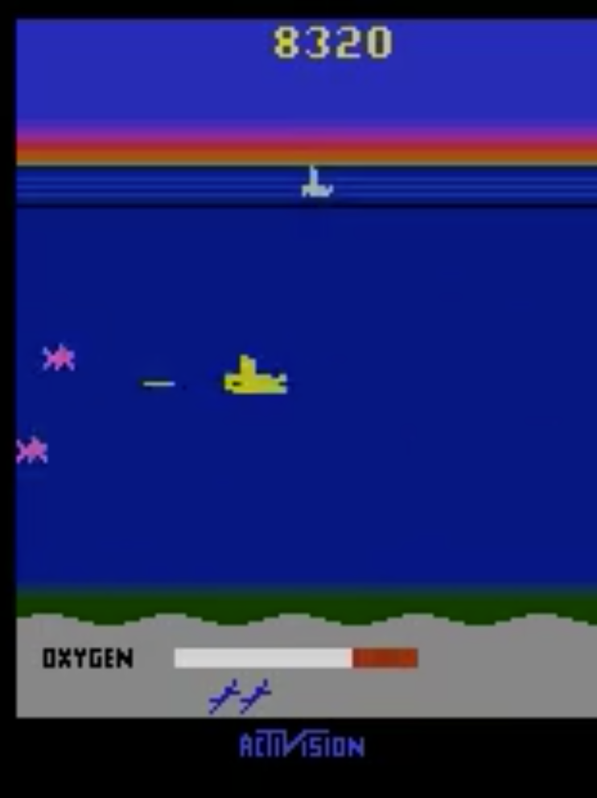

# Playing Atari 2600 & Super Mario Bros. with Deep Reinforcement Learning

<p float="left" align="center">



</p>

Using Double Dueling Deep-_Q_ Networks to play Atari 2600 games and Super
Mario Bros from the Nintendo Entertainment System (NES).

## Usage

### `virtualenv`

Use `virtualenv` to contain the environment to a single
local installation of python3:

##### Setup

To setup the virtual environment:

```shell
virtualenv -p python3 .env
source .env/bin/activate
```

When you've concluded the session:

```shell
deactivate
```

### Dependencies

[requirements.txt](requirements.txt) lists the Python dependencies for the
project with frozen versions. To install dependencies:

```shell
python -m pip install -r requirements.txt
```

**NOTE** if you're NOT using `virtualenv`, ensure that `python` aliases
python3; python2 is not supported.

#### Test Cases

To execute the `unittest` suite for the project run:

```shell
make test
```
